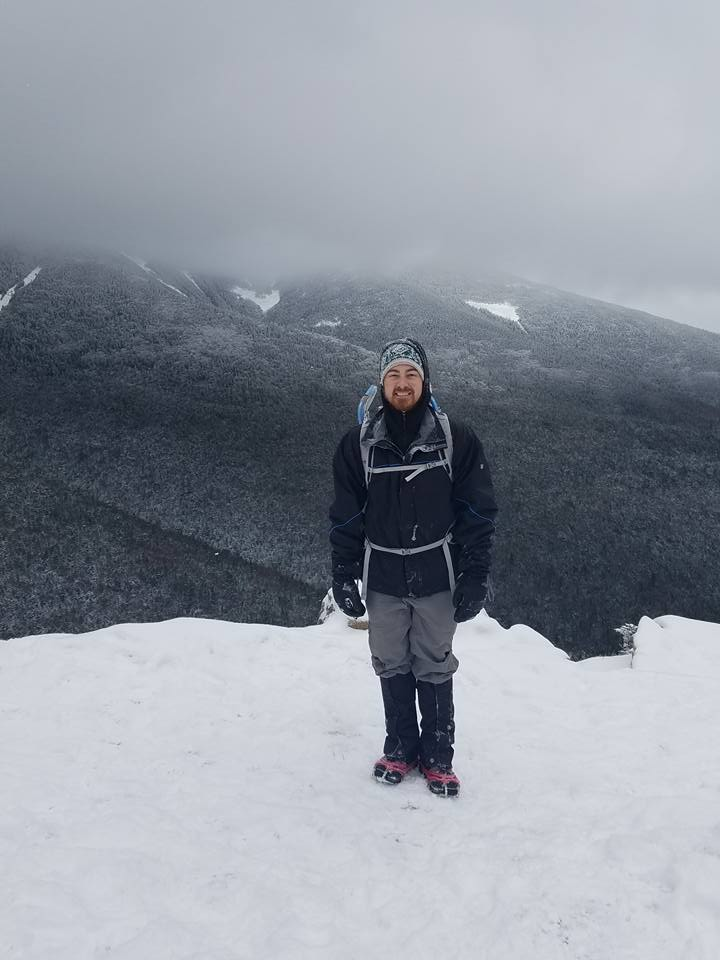

Hello and thanks for visiting! I'm Ben Decato, a Senior
Scientist in the Translational Bioinformatics department at
[Bristol Myers Squibb](www.bms.com), focusing on clinical biomarker discovery
and development in non-oncology diseases including heart failure with preserved
ejection fraction, idiopathic pulmonary fibrosis, and non-alcoholic steatohepatitis.

I earned a Ph.D in Computational Biology and Bioinformatics in 2018 from the
[Department of Molecular and Computational Biology](http://www.dornsife.usc.edu/cbb)
at the [University of Southern California](https://www.usc.edu), working in the
lab of [Dr. Andrew Smith](https://www.smithlabresearch.org). Before starting at
USC in 2012, I completed a B.S. in Computer Science from the
[University of New Hampshire](https://www.cs.unh.edu), and did research in
Bioinformatics with my undergraduate advisor, [Dr. Phil Hatcher](https://www.cs.unh.edu/~pjh).

My full CV is available [here](Papers/CV_BDecato_010121.pdf), although there is no guarantee
it is entirely up-to-date. A complete suite of contact options are shown below,
and I am always open to new collaborations, github pull requests, and
opportunities. Hope to hear from you soon!

Opinions expressed on this site are personal and are not meant to represent the
official position of any employer, past or present.

|  |
|:--:|
| *A cloudy winter day on Mt Lafayette in New Hampshire* |
